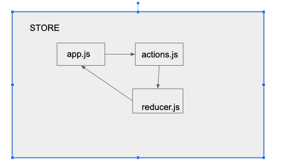

 LAB
=================================================

## Inroduction to Redux

### Author: Melissa Stock

### Links and Resources
* [submission PR](https://github.com/401-advancedjs/application-state/pull/1)
* [front-end](https://codesandbox.io/s/starter-code-app-state-pznj2)

### Modules
#### `app.js`
#### `reporter.js`
#### `thunk.js`
#### `actions.js`
#### `reducers.js`

#### Running the app
* `npm start`
  
#### Tests
* How do you run tests?
  * `npm run test`
* What assertions were made?
  * no assertions were made
* What assertions need to be / should be made?
  * basic rendering
  * rendering follows snapshot
  * functional components behave in an expected manner

#### UML

